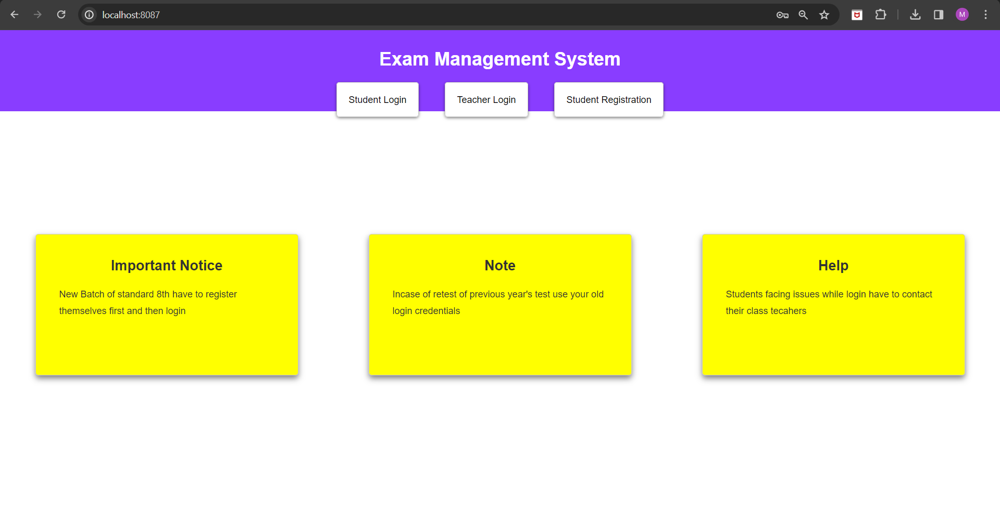
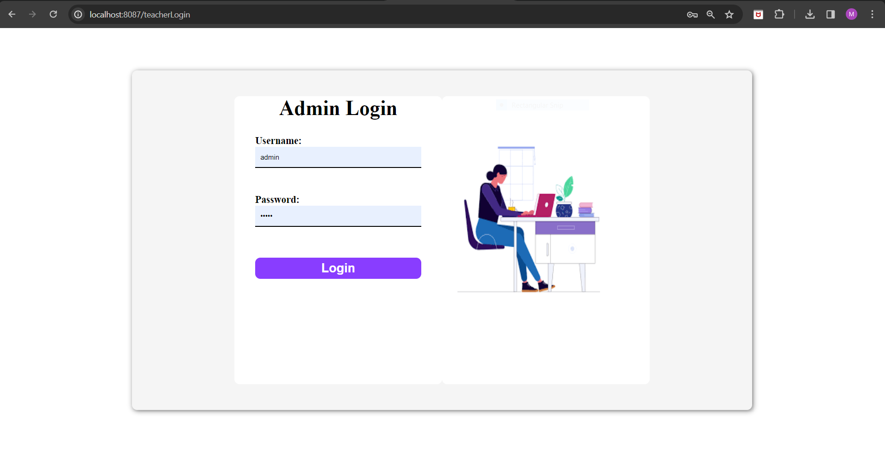
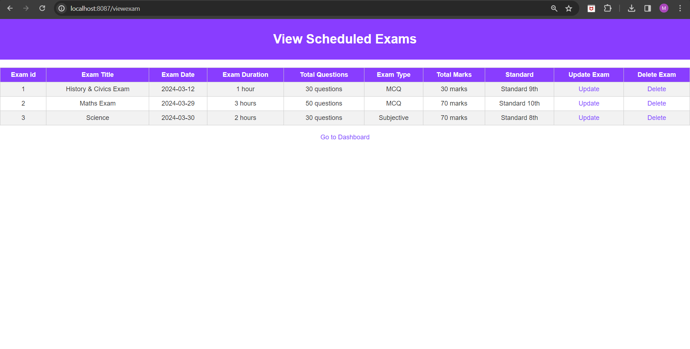

# Exam Management System

## Overview
This is a Spring Boot-based Exam Management System. It provides functionalities for managing exams, questions, students, and grading.

## Features
- **Exam Management**: Create, update, delete exams.
- **Student Management**: Student can view exam.


## Technologies Used
- Spring Boot
- Spring MVC
- Spring Data JPA
- MySQL

## Setup Instructions
1. **Clone the repository**:
   ```bash
   git clone https://github.com/mrunal0502/Exam_Management_System.git

## Screenshots





## Contributing
Contributions are welcome! Please fork the repository and create a pull request with your changes.
